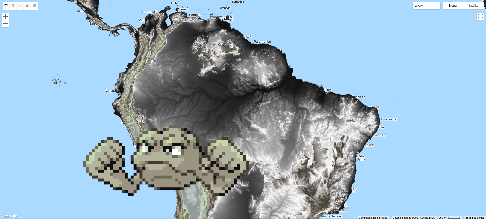

# ee-pokepalettes
**Pokemon Color Palettes for the Google Earth Engine JavaScript API (Code Editor)**

[](https://opensource.org/licenses/MIT)
[](https://twitter.com/dmlmont)

**Table of Contents**

- [Overview](#Overview)
- [How does it work?](#How-does-it-work?)
- [Poke-examples!](#Poke-examples!)
- [License](#License)

## Overview

[Google Earth Engine](https://earthengine.google.com/) (GEE) is a cloud-based service for geospatial processing of vector and raster data. The Earth Engine platform has a [JavaScript and a Python API](https://developers.google.com/earth-engine/guides) with different methods to process geospatial objects. Google Earth Engine also provides a [HUGE PETABYTE-SCALE CATALOG](https://developers.google.com/earth-engine/datasets/) of raster and vector data that users can process online. The ee-pokepalettes is a just-for-fun module that allows you to use [Pokemon Color Palettes](https://pokepalettes.com/) to plot your data in GEE!

Check the usage of ee-pokepalettes here:

```javascript
var poke = require("users/dmlmont/pokepalettes:pokepalettes");

var ndvi = ee.ImageCollection('MODIS/006/MOD13A2')
  .filter(ee.Filter.date('2018-01-01', '2019-01-01'))
  .median()
  .divide(10000)
  .select("NDVI");

var vis = {
  min: 0.0,
  max: 1.0,
  // METAPOD!!!!!!
  palette: poke.palettes.metapod,
};

Map.addLayer(ndvi, vis, 'NDVI');
```

## How does it work?

The ee-pokepalettes module can be accepted [HERE](https://code.earthengine.google.com/?accept_repo=users/dmlmont/pokepalettes). Once accepted, it can be required by running the following line in the GEE JavaScript Code Editor:

```javascript
var poke = require("users/dmlmont/pokepalettes:pokepalettes");
```

The complete list of pokemon color palettes can be accessed by using the palettes attribute:

```javascript
print(poke.palettes)
```

A palette can be accessed using dot notation:

```javascript
print(poke.palettes.pikachu)
```

Or by using a key:

```javascript
print(poke.palettes["mr. mime"])
```

Create a color bar using `colorbar(title,minValue,maxValue,palette)`:

```javascript
print(poke.colorbar("My title",0,100,poke.palettes.charmander))
```

## Poke-examples!

### Geodude DEM! [](https://code.earthengine.google.com/da89aa6ffb407b0f80c83edc99ca3b8a)



### Charizard LST! [](https://code.earthengine.google.com/fce3bd4518ac99229d4e9dd51911fd9b)


### Metapod NDVI! [](https://code.earthengine.google.com/593e7ef08770341e920f4bed8fbcc058)


### Kingdra Precipitation! [](https://code.earthengine.google.com/1824d1f55e0b6ab59d66735a3da30e7a)


## License

The project is licensed under the MIT license.